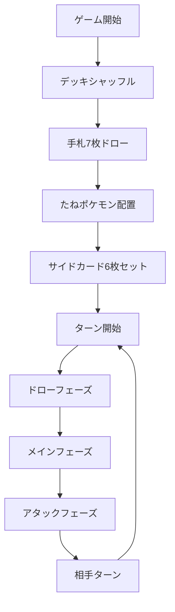

# 🎴 ポケモンカードゲーム

<div align="center">

**モダンなWeb技術で再現されたポケモンカードゲーム**

[](https://developer.mozilla.org/en-US/docs/Web/JavaScript)
[](https://html.spec.whatwg.org/)
[](https://www.w3.org/Style/CSS/)
[](https://nodejs.org/)

[🎮 デモを見る](#デモ) • [📖 使い方](#使い方) • [🚀 セットアップ](#インストール) • [🤝 貢献](#貢献)

</div>

---

## 📋 概要

このプロジェクトは、**純粋なJavaScript**を使用して開発されたポケモンカードゲームのWebアプリケーションです。ブラウザ上で本格的なポケモンカードバトルを楽しむことができます。

### ✨ 主な特徴

- 🎯 **本格的なルール実装** - 公式ルールに準拠したターン制バトル
- 🎨 **美しいUI/UX** - 直感的で視覚的に魅力的なインターface
- 🔄 **スムーズなアニメーション** - カードの移動や戦闘エフェクト
- 🎪 **統合カードエディタ** - カスタムカードの作成・編集機能
- 📱 **レスポンシブデザイン** - デスクトップ・モバイル対応
- ⚡ **高性能** - モジュラー設計による最適化

## 🎮 ゲームの流れ



## 🚀 インストール

### 必要条件

- **Node.js** v14.0.0 以上
- **npm** または **yarn**
- モダンブラウザ（Chrome, Firefox, Safari, Edge）

### セットアップ手順

```bash
# リポジトリをクローン
git clone https://github.com/your-username/pokemon-card-game.git

# ディレクトリに移動
cd pokemon-card-game

# 依存関係をインストール
npm install

# 開発サーバーを起動
npm start
```

サーバーが起動したら、ブラウザで `http://localhost:3000` にアクセスしてください。

## 🎲 使い方

### ゲーム操作

| 操作 | 説明 |
|------|------|
| **カードクリック** | 手札からカードを選択 |
| **ドラッグ&ドロップ** | カードをバトル場・ベンチに配置 |
| **右クリック** | カード詳細を表示 |
| **スペースキー** | ターン終了 |

### ゲームフェーズ

1. **セットアップフェーズ**
   - たねポケモンをバトル場に配置
   - ベンチポケモンを最大5匹まで配置可能

2. **メインフェーズ**
   - エネルギーカードを1ターンに1枚添付
   - ポケモンの進化
   - トレーナーズカードの使用

3. **アタックフェーズ**
   - ワザを選択して相手を攻撃
   - ダメージ計算と特殊効果の適用

### カードエディタ

🎴 **カードエディタ機能** でオリジナルカードを作成できます：

- 新規カード作成（ポケモン・エネルギー・トレーナーズ）
- 既存カードの編集・複製
- 画像アップロード対応
- リアルタイムプレビュー
- ゲームとのシームレス連携

## 🏗️ 技術構成

### フロントエンド

```javascript
// コア技術
- Vanilla JavaScript (ES6+)
- HTML5 Canvas & WebGL
- CSS3 (Grid, Flexbox, Animations)
- Modular Architecture (ES Modules)
```

### アーキテクチャ

- **MVC パターン** - Model, View, Controller の分離
- **コンポーネント設計** - 再利用可能なモジュール
- **状態管理** - Immutable state updates
- **アニメーションシステム** - Queue-based animations

### 主要モジュール

| モジュール | 責任 |
|------------|------|
| `game.js` | ゲームロジック・制御 |
| `view.js` | UI描画・DOM操作 |
| `state.js` | 状態管理・初期化 |
| `logic.js` | ゲームルール・純粋関数 |
| `animation-manager.js` | アニメーション統合管理 |

## 📁 プロジェクト構造

```
pokemon/
├── 📁 js/                    # JavaScriptモジュール
│   ├── 📁 animations/        # アニメーション関連
│   ├── 🎮 game.js           # メインゲームクラス
│   ├── 🖼️  view.js           # 描画エンジン
│   └── ⚙️  logic.js          # ゲームルール
├── 📁 data/                  # カードデータ
│   └── 🗃️  cards-master.json # カードマスターデータ
├── 📁 assets/                # 画像・UI素材
│   ├── 📁 cards/            # カード画像
│   └── 📁 ui/               # UI素材
├── 🌐 index.html            # メインゲーム
├── 🎴 card_viewer.html      # カードエディタ
└── 🖥️  server.js            # 開発サーバー
```

## 🎯 ロードマップ

### 📅 短期目標 (v2.0)

- [ ] オンライン対戦機能
- [ ] 追加のカードセット
- [ ] サウンド・BGM実装
- [ ] チュートリアルモード

### 🌟 長期目標 (v3.0)

- [ ] トーナメントシステム
- [ ] カスタムデッキ構築
- [ ] レーティングシステム
- [ ] モバイルアプリ版

## 🤝 貢献

プロジェクトへの貢献を歓迎します！

### 貢献方法

1. このリポジトリをフォーク
2. 機能ブランチを作成 (`git checkout -b feature/awesome-feature`)
3. 変更をコミット (`git commit -m 'Add awesome feature'`)
4. ブランチにプッシュ (`git push origin feature/awesome-feature`)
5. プルリクエストを作成

### 開発ガイドライン

詳細な開発ガイドラインは [CLAUDE.md](./CLAUDE.md) をご覧ください。

### バグ報告

バグを発見した場合は、[Issues](https://github.com/your-username/pokemon-card-game/issues) で報告してください。

## 📄 ライセンス

このプロジェクトは [MIT License](LICENSE) の下で公開されています。

## 🙏 謝辞

- **ポケモン** - オリジナルのカードゲームデザイン
- **コミュニティ** - フィードバックと貢献
- **オープンソース** - 使用したライブラリ・ツール

---

<div align="center">

**⭐ このプロジェクトが気に入ったらスターをお願いします！**

[🐛 バグ報告](https://github.com/your-username/pokemon-card-game/issues) • [💡 機能提案](https://github.com/your-username/pokemon-card-game/issues) • [📧 お問い合わせ](mailto:your-email@example.com)

</div>